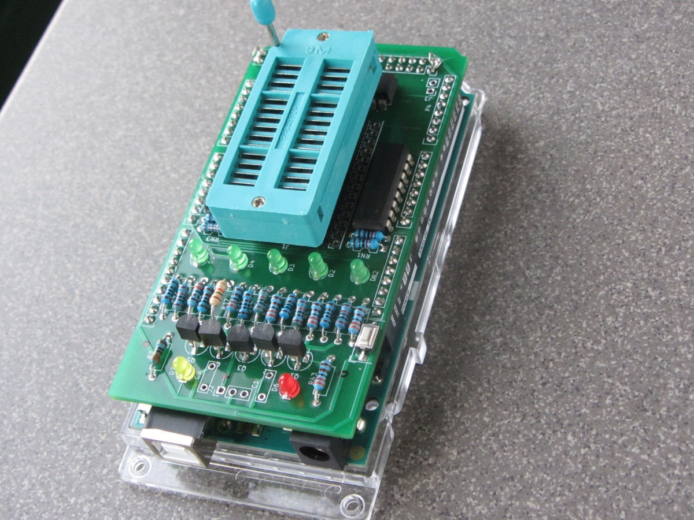

# logicTester

This is a POC (proof-of-concept) of a simple but configurable 'SSI'-logic I.C-tester.

Unlike some other testers, you have to specify which I.C. you have and the script
reports proper working or a failure.

This tester splits the low-level measuring tasks from the high-level data
library, test data generation and comparison tasks. The low-level functionality
is implemented in an Arduino sketch which communicates with the high-level control
and compare functionality build in Python. The Python script does contain the I.C.
data, this is read from a text-based configuration file. As long as the behaviour
at the output pins can be defined in Boolean logic, the chip can be tested.

The current version 1.5 is expanded with a new chip-test format, which allows
defining each change at the chip pins to be defined. It uses the same communication
protocol to the Arduino sketch, making the change Python and library only.

The old protocol used boolean logic definition to generate each possible
permutation of the input pins with the expected result. The new format requires
each state or state change to be explicitly defined in the library file.
This is much more flexible, as it even allows on-the fly-change of pins from
input to output or vice-versa (like 74LS245). The backdraw is tedious coding of 
states in a text file. The tool can be used interactive, helping in catching typo's
in the definition.

Only the logic behaviour is tested, not wether the I.C. conforms to TTL or CMOS
specifications.

## Hardware

### Mega version

The Arduino Mega 2560 shield version has automatic power switching for pin 14, 16, 20, 24 and 28.

More info (schema and PCB details) on the Hackaday.io page.

### Mega 2560 shield

<a href="schemav1.4.pdf">The schema of the test version</a>. This version allows for wide and narrow I.C.s, up to
28 pins with power on the highest pin number. For other layouts, expected to be more exceptional, a bread board
solution could be devised.

For now, the Arduino sketches for the Uno and Mega are the same, the difference is in the pinMap.h.

## Configuration

The configuration file format is currently implemented as json, but omitting the outer braces.

    "type": "7402", "pins": 14, "config": "C:Q,2,3,Q,5,6,G,8,9,Q,11,12,Q,V",  "M1": "!(2|3)", "M4": "!(5|6)", "M10": "!(8|9)",  "M13":  "!(11|12)"

In the config section, the inputs (exercise pins) are numbered as the pin number,
the outputs indicated as 'Q', the ground and Vcc pins as 'G' and 'V'. This is a
compromise between human-readable, machine readable and compactness.

The M? sections relate to the I.C output pins and contain a Boolean-expression
defining the output in terms of input lines and characters defining logical
expressions; ! = NOT, | is OR, & is AND and ^ as XOR.

## Usage

The Python script is written with Python 3.6.9 on Linux Xubuntu 18.04.

The script is started with ***python3 &lt;port&gt; &lt;chip&gt;***

***port*** the the serial port, Baud rate is 9600 Bd.

***chip*** is the chip to test. Currently about 40 TTL I.C.s are
completely implemented and tested. See the icLibrary.txt file for details.

Example:

    python3 icTest.py /dev/ttyUSB1 7402

## Message format

This is the current help message from the Arduino:

    ICtest 1.4
    C - configure pins
    D - debug mode
    E - exercise pin with 500ms cycle
    H - this text
    Q - set and query pins
    R - reset config and pins
    Z - test for tri-state output

Messages to and from Arduino:

* **C:&lt;pin-spec&gt;** - configure the pins on the Arduino. If the pin-numbering is
supported the response is "**OK**". If not the response is "**ERROR**".

Example:

    C:Q,2,3,Q,5,6,G,8,9,Q,11,12,Q,V
    
Response example:

    OK

* **Q:&lt;set-and-query&gt;** - specifies the values for the I.C. input pins. The
response is modified copy;the first char is '**R**' and the I.C. output pin values
are filled in.

Example:

    Q:-,1,0,-,0,0,G,0,0,-,0,0,-,V
    
Response example
    
    R:L,0,1,1,L,0,G,0,0,H,0,0,H,V
    
The response is similar to the sent message
but with output pin levels filled in. Using "H" and "L" so the difference between
input and output pins is still visible.

* **R** - reset all pins to tri-state and erase configuration.

Response example:

    OK

### From Arduino:

### Stand alone Arduino commands
  
The Arduino code has some extra commands not used by the Python code, but useful
for 'manual' debugging.

* **D** - switch on and off debug mode. With debug on the Arduino becomes more
talkative, but this is not supported by the Python script. De arguments are 1 for
on and 0 for off. One character has to be between the 'D' and the number.

Example:

    D:1
  
* **E** - this generates a 500 ms square wave on one pin. The idea is to set up
a pattern of 1's and 0's on all input pins using the **Q:** command and use **E**
to see the response on the output pins. The default check pattern from the Python
script isn't very intuitive for this.

Example:

    E:11

### New format description

The new definition format lacks the "config" key, this also the distinction 
for the python script. Apart of the "type" key, used to find the definition
and the "pins" key (mostly decorative here), all lines are close to the actual 
commands send to the Arduino. The keys however have a numeric prefix, terminated
with a "_", only to make them unique (the JSON is converted to a Python dict
which requires unique keys). The numeric string doesn't have to be in 
incrementing order but this make the uniqueness easy to check. The prefix is 
removed in the string send to the Arduino, but kept for the error messages.

The new format is usually much faster, as usually only the essential 
patterns are encoded. The old format generates (and checkes) just every
possible pattern.

## Process

The Python script sends the config string to the Arduino, which initialises the
pins. It then calculates the number of permutations and sends a query for each
to the Arduino. It also calculates the expected response based on the Boolean
expressions in the 'M? sections.

The response of the Arduino is compared with this expected response and
differences are flagged. On completion the number of errors is reported. Default
the script is quite chatty, so you can see what it does. Even more print's are
commented out, very handy for debugging. The Arduino sketch cost me one day, the
Python script two, almost debugging each individual line with print()'s.

Also see the [ToDo](ToDo.txt) for what isn't there yet but could be.

There is also a <a href="https://hackaday.io/project/175252-simple-ttl-logic-tester">Hackaday page</a>.
