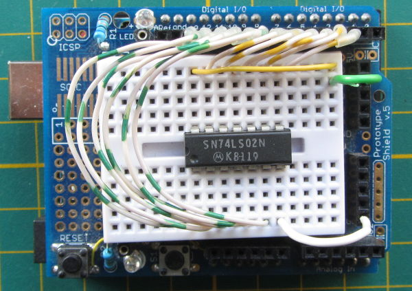

# logicTester

This is a POC (proof-of-concept) of a simple but configurable 'SSI'-logic I.C-tester,

The idea is to split the low-level measuring tasks from the hight-level data 
generation and comparison tasks. The low-level functionality is implemented in
an Arduino sketch which communicates with the high-level functionality build in
Python. The Python script does contain the I.C. data, this is read from a text-
based configuration file. As long as the behaviour at the output pins can be defined
in Boolean logic, the chip can be tested. 

The current version is limited to stateless gates and inverters. So far I didn't 
try to define a machine-parsable notation for I.C.s with clocked or register
functionality. A limitation of the Arduino sketch is that it currently only 
supports 14 and 16 pin I.C.s and the switch is manual. 

Only the logic behaviour is tested, not wether the I.C. conforms to TTL or CMOS 
specifications.

## Configuration

The configuration file is currently implemented as json, but omitting the outer braces.

   "type": "7402", "pins": 14, "config": "C:Q,2,3,Q,5,6,G,8,9,Q,11,12,Q,V",  "M1": "!(2|3)", "M4": "!(5|6)", "M10": "!(8|9)",  "M13":  "!(11|12)"

## Message format

To Arduino:

* **C:&lt;pin-spec&gt;** - configure the pins on the Arduino. If the pin-numbering is
supported the response is "OK". If not the response is "**ERROR**".

Example: C:Q,2,3,Q,5,6,G,8,9,Q,11,12,Q,V

* **Q:&lt;set-and-query&gt;** - specifies the values for the I.C. input pins. The 
response is modified copy;the first char is '**R**' and the I.C. output pin values 
are filled in.

Example: Q:-,1,0,-,0,0,G,0,0,-,0,0,-,V

* **R** - reset all pins to tri-state and erase configuration.

From Arduino:

* OK - response to **C:&lt;pin-spec&gt;** and **R**

* **R:&lt;query_result&gt;** similar to the **Q:-,1,0,-,0,0,G,0,0,-,0,0,-,V**
but with output pin levels filled in.

Example: R:0,0,1,1,0,0,G,0,0,1,0,0,1,V
